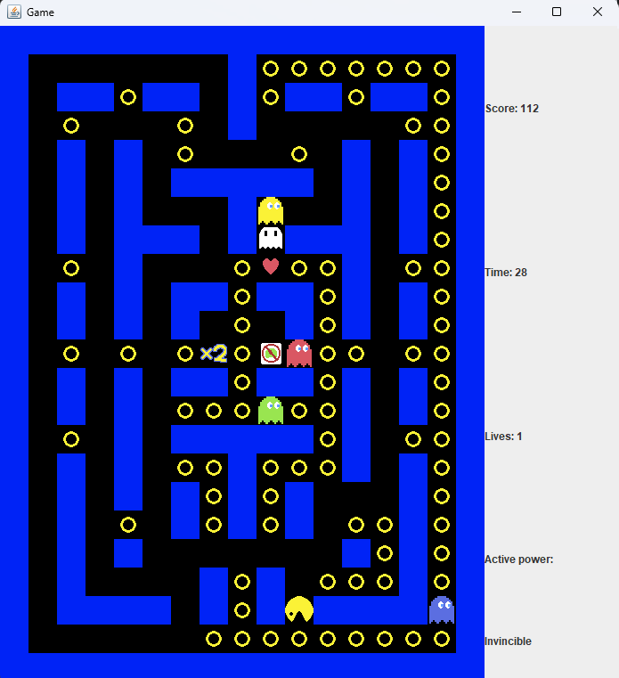
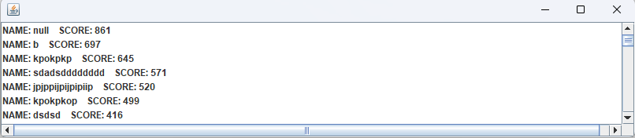

# Pac-Man
Pac-Man style game written in Java

The GUI was done using the Swing library 

The game features:
  - 5 predetermined boards stored as text files
  - a highscore board
  - game, enemy and display logic done using multithreading
  - custom power-ups modifying player behavior, game state and enemy behaviour

## Used technologies
  - Swing library was used for creating the GUI elements using custom sprites stored as pngs
  - Animations and power-ups were manually implemented

## Screenshots

 
 
 

## Additional notes
Project was done as a final project as part of a GUI course at Polish-Japanese Academy of Information Technology 

